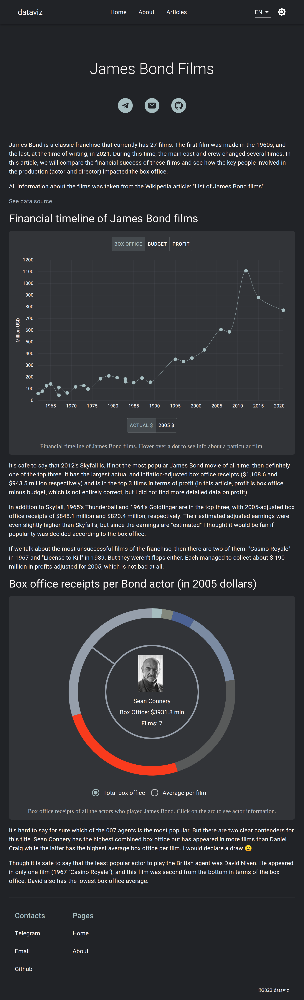

# Dataviz

A frontend application - small collection of data visualizations made with React and d3.js.

*[Live version](https://george-mix.github.io/data-visualization/) of the project.*



## Technology Stack 
Here's a brief overview of the tech stack the Dataviz app uses:
- [TypeScript](https://github.com/microsoft/TypeScript) - main language of the project
- [Vite](https://github.com/vitejs/vite) - build tool
- [React](https://github.com/facebook/react) - library to build SPA user interface (v17)
- [d3](https://github.com/d3/d3) - library used for building data visualisations
- [MUI](https://github.com/mui/material-ui) - library of React components
- [Redux Toolkit](https://github.com/reduxjs/redux-toolkit) - client state
- [React Query](https://github.com/TanStack/query) - server state

## Install / Local Set Up

After you have downloaded this repo rename `.env.example` to `.env` and run

```sh
npm install
npm run dev
```

## License

[MIT](https://opensource.org/licenses/MIT)
